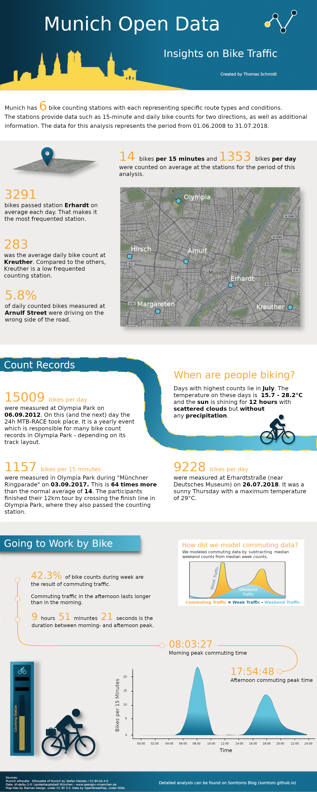
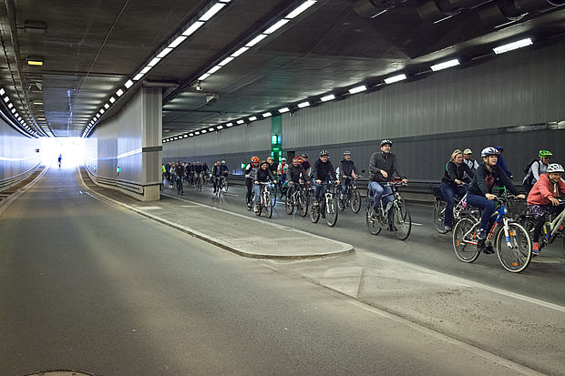

<div id="analysis" style="display: none">
***

During this year's summer break there had been a railway construction site which affected the 
train I usually use for commuting to work. This led to a lot of additional commuting time.
Thus, I decided to repair my old mountain bike and give it a try to go to work by bike.   
During the one hour ride I wondered how many people made the same decision and if there would be
any data about Munich bike traffic with the use of which I could get some insights about 
Munich's bike traffic. Shortly after that, I happened to see a twitter post of
[OpenData Munich](https://twitter.com/opendata_muc/status/1039758780853104646) which announced a
new data set containing the data of Munich's 6 continuous bike counting stations for the years
2017 and 2018. The counting stations provide data such as 15-minute and daily bike counts for 2 directions.

I contacted the team in order to ask for additional information and received even more data as well
as some nice inspirations. I picked up the idea of creating a info-graphic about Munich bike data.
Thus, I had a new project and started the journey of designing my first info-graphic.

In this post we will go through the analysis behind the info-graphic you already saw above. 
We will answer questions such as:

* [Can we create a map of all counting stations?](#map)
* [What are average 15 minute and daily counts (across stations and per station)?](#average_counts)
* [How many people are driving in the wrong direction at Arnulf Street
(this station is at a one-way road)?](#wrong_direction)
* [What are the highest counts which had been measured?](#count_records)
* [When are most people biking (time of the year, weather, ...)?](#bike_times)
* [How does the commuting traffic look like?
Can we model it somehow and get some insights out of the data?](#commuting)

If you want to skip the data import and jump directly to the preprocessing step,
click [here](#preprocessing). To directly get into the analysis, click [here](#analysis).

# Set up Environment

First, as always, we load some packages needed for this analysis and create a custom theme 
to make the plots look nicer.

```{r setup}
suppressMessages({
  library(tidyverse)
  library(lubridate)
  library(geosphere)
  library(ggmap)
  library(reshape2)
  library(modelr)
  library(broom)
})

background_colors <- c("#efedec", "white")
plot_colors <- c("#62c3db", "#136d8f", "#072d40", "#f6a735", "#fbd74d")
line_colors <- c("black")

# Custom theme
my_theme <- list(
 theme(
    plot.background = element_rect(fill =  background_colors[2]),
    text = element_text(color = line_colors),
    panel.background = element_rect(fill =  background_colors[2]),
    panel.grid.major.y = element_blank(),
    panel.grid.minor = element_blank(),
    panel.grid.major.x = element_blank(),
    panel.grid.minor.x = element_blank(),
    axis.line.y = element_line(color =  line_colors),
    axis.line.x = element_line(color =  line_colors),
    axis.ticks = element_line(color =  line_colors),
    axis.title.y = element_text(margin = margin(t = 0, r = 20, b = 0, l = 0), color = line_colors),
    axis.title.x = element_text(margin = margin(t = 10, r = 0, b = 0, l = 0), color = line_colors),
    legend.position = "bottom",
    plot.margin = unit(c(0.5,1,0.5,0),"cm"),
    strip.background = element_rect(fill = "white", color = "black")
),
  scale_color_manual(
    values = plot_colors,
    guide = guide_legend(direction = "horizontal", label.hjust = 0.5, title.position = "top",
                              title.hjust = 0.5)),
  scale_fill_manual(
    values = plot_colors,
    guide = guide_legend(direction = "horizontal", label.hjust = 0.5, title.position = "top",
                              title.hjust = 0.5)))
```

```{r knitr_setup, echo=FALSE}
knitr::opts_chunk$set(
    fig.width   = 10,      
    .fig.asp = .62,      
    fig.align   = 'center', 
    echo        = TRUE)  
```


# Import Data from API
Now, after setting everything up, we need to load the data. Since I got some additional data in 
`.csv` format, the importing will happen in two steps:

1. We import the data from 2017 and 2018 via the Munich Open Data API
2. We import the additional data from `.csv` format


## Helper Functions

To fetch the data via API, I wrote some helper functions. This functions will also help us with the
preprocessing later. The functions can be found in the 
[Github project](https://github.com/Somtom/munich-bike-data-analysis). 

```{r helper_functions, echo=FALSE}
convert_to_default_dt_string <- function(datetime_val = NA, date_val) {
  # Function which converts the datetime strings to the standard format of "%Y-%m-%d %H:%M:%S"
  # or "%Y-%m-%d" if only date_val provided
  
  # Iso 8601 format: "%Y-%m-%dT%H:%M:%S"
  iso8601_format = "[:digit:]{4}-[:digit:]{2}-[:digit:]{2}T[:digit:]{2}:[:digit:]{2}:[:digit:]{2}"
  # hour_minute format: "%H.%M"
  hour_minute_format = "[:digit:]{2}.[:digit:]{2}$"
  
  iso_date_format = "[:digit:]{4}-[:digit:]{2}-[:digit:]{2}$"
  # date format: "%Y.%m.%d"
  date_format = "[:digit:]{4}.[:digit:]{2}.[:digit:]{2}$"
  
  if (!is.na(datetime_val)) {
    # Extract date from date_val in case it is given in datetime format
    date_val = str_extract(date_val, "[:digit:]{4}-[:digit:]{2}-[:digit:]{2}")
    
    # If datetime_val matches Iso 8601 format: Replace "T" with " " and return
    if (stringr::str_detect(datetime_val, iso8601_format)) {
      return(stringr::str_replace(datetime_val, "[:digit:]{4}-[:digit:]{2}-[:digit:]{2}T",
                                  paste0(date_val, " ")))
    }
    # If datetime_val matches hour_minute_format: Add date and seconds
    if (stringr::str_detect(datetime_val, hour_minute_format)) {
      # Replace "." with ":" in datetime_val
      datetime_val = gsub("\\.", ":", datetime_val)
      return(paste0(date_val, " ", datetime_val, ":00"))
    }
  }
  if (is.na(datetime_val)) {
    # date value in iso date format: return it as it is
      if (stringr::str_detect(date_val, iso_date_format)) {
        return(date_val)
      }
    # if date value in date_format: convert it to iso_date_format
      if (stringr::str_detect(date_val, date_format)) {
        return(gsub( "\\.", "-", date_val))
      }# if date value in iso8601_format: convert it to iso_date_format
      if (stringr::str_detect(date_val, iso8601_format)) {
         return(str_extract(date_val, "[:digit:]{4}-[:digit:]{2}-[:digit:]{2}"))
      }
  }
  warning("Datetime value had undefined format")
  NA
  
}


muc_odp_fetch_bike_count_resource_ids <- function(
  baseUrl = "https://www.opengov-muenchen.de",
  path = "/api/3/action/package_search?q=daten-der-raddauerzaehlstellen-muenchen",
  limit = "100") {
  require(dplyr)
  require(tidyr)
  
  # get raw_results
  raw_result <- httr::GET(url = "https://www.opengov-muenchen.de",
                          path = paste0(path, "&rows=", limit))
  results <- httr::content(raw_result)$result$results
  
  # Extract dataset name and id from results
  resource_information <- list(
    data_collection_name = unlist(lapply(results, function(x) x$name)),
    datasets = lapply(results, function(x) bind_rows(
      lapply(x$resources, function(y) data.frame(
        name = y$name,
        resource_id = y$id,
        stringsAsFactors = F)))
    )
  ) %>% 
    bind_rows() %>% 
    tidyr::unnest()
  
  # extract month and year from name
  german_month_names <- c("Januar", "Februar", "März", "April", "Mai", "Juni", "Juli", "August", "September",
                          "Oktober", "November", "Dezember")
  
  correct_name <- function(name) {
    # Change name string of Juli 2018 (15 Minutes missing in name) - as of 13.10.2018
    if (name == "Daten der Raddauerzählstellen München Juli 2018") {
      print("FOUND JULI")
      name <- "15 Minuten-Werte - Daten der Raddauerzählstellen München Juli 2018"
    }
    # Change name for "#Month#" 2018 to März 2017 (data_collection_name says 2017!)
    if (name == "15 Minuten-Werte - Daten der Raddauerzählstellen München #Monat# 2018") {
      print("FOUND MARCH")
      name <- "15 Minuten-Werte - Daten der Raddauerzählstellen München März 2017"
    }
    
    return(name)
  }
  
  resource_information <- resource_information %>% 
    mutate(name = sapply(name, function(x) correct_name(x)),
           year = stringr::str_extract(name, "[:digit:]{4}"),
           month = stringr::str_extract(name, paste(german_month_names, collapse = "|")),
           month = match(month, german_month_names))
  
  ids_15_min <- resource_information %>% 
    filter(stringr::str_detect(name, "15 Minuten")) %>% 
    arrange(year, month)
  
  #filter for names containing "Tageswerte und Wetter"
  ids_daily <- resource_information %>% 
    filter(stringr::str_detect(name, "Tageswerte und Wetter")) %>% 
    arrange(year, month)
  
  return(list(
    ids_15_min = ids_15_min,
    ids_daily = ids_daily
  ))
}


muc_odp_fetch_data <- function(baseUrl = "https://www.opengov-muenchen.de",
                              path = "api/3/action/datastore_search",
                              limit = "100000",
                              resource_id,
                              destination = "./data/",
                              force_fetch = FALSE) {
  
  file_name = paste0(destination, resource_id, ".RDS")
  
  # check if data already fetched
  if (file.exists(file_name) & !force_fetch) {
    print(paste("File for resource already exists at", file_name))
    return(readRDS(file_name))
  }
  else {
    # get raw results
    raw_result <- httr::GET(url = baseUrl, path = paste0(path,
                                                         "?resource_id=", 
                                                         resource_id,
                                                         "&limit=",
                                                         limit))
    
    print(paste0("Fetching data from ", 
                 path,
                 "?resource_id=", 
                 resource_id,
                 "&limit=",
                 limit))
    
    result <- httr::content(raw_result)
    print(paste('Fetched', length(result$result$records), 'results...'))
    
    res <- dplyr::bind_rows(result$result$records)
    
    # write results to ./data/ folder
    saveRDS(res, file = file_name)
    
    return(res)
  }
}


muc_odp_convert_bike_counter_types <- function(dt) {
  require(dplyr)
  require(readr)
  
  dt %>% 
    transmute(
      besonderheiten = as.character(besonderheiten),
      zaehlstelle = as.factor(zaehlstelle),
      longitude = as.numeric(longitude),
      latitude = as.numeric(latitude),
      richtung_1 = as.character(richtung_1),
      richtung_2 = as.character(richtung_2),
      id = `_id`
    )
}


muc_odp_convert_bike_cnt_15_min_types <- function(dt) {
  require(dplyr)
  
  dt %>% 
    transmute(
      datum = lubridate::fast_strptime(sapply(datum, function(x)
        convert_to_default_dt_string(date_val = x)),
        format = "%Y-%m-%d", lt = FALSE),
      uhrzeit_start = lubridate::fast_strptime(mapply(function(x, y) convert_to_default_dt_string(x, y),
                                        uhrzeit_start,
                                        datum), format = "%Y-%m-%d %H:%M:%S", lt = FALSE),
      uhrzeit_ende = lubridate::fast_strptime(mapply(function(x, y) convert_to_default_dt_string(x, y),
                                       uhrzeit_ende,
                                       datum), format = "%Y-%m-%d %H:%M:%S", lt = FALSE),
      gesamt = as.integer(gesamt),
      zaehlstelle = as.factor(zaehlstelle),
      richtung_1 = as.integer(richtung_1),
      richtung_2 = as.integer(richtung_2)
    )
}


muc_odp_convert_bike_cnt_day_types <- function(dt) {
  require(dplyr)
  
  
  dt %>% 
    transmute(
      datum = lubridate::fast_strptime(sapply(datum, function(x)
        convert_to_default_dt_string(date_val = x)),
        format = "%Y-%m-%d", lt = FALSE),
      uhrzeit_start = lubridate::fast_strptime(mapply(function(x, y) convert_to_default_dt_string(x, y),
                                                      uhrzeit_start,
                                                      datum), format = "%Y-%m-%d %H:%M:%S", lt = FALSE),
      gesamt = as.integer(gesamt),
      zaehlstelle = as.factor(zaehlstelle),
      richtung_1 = as.integer(richtung_1),
      richtung_2 = as.integer(richtung_2),
      bewoelkung = as.numeric(bewoelkung),
      sonnenstunden = as.numeric(gsub(",", ".", `sonnenstunden`)),
      niederschlag = as.numeric(gsub(",", ".", `niederschlag`)),
      max_temp = as.numeric(gsub(",", ".", `max-temp`)),
      min_temp = as.numeric(gsub(",", ".", `min-temp`)),
      id = `_id`
    )
}

muc_odp_add_direction_info <- function(dt) {
  require(dplyr)
  
  OUT_OF_CENTER = "out of center"
  INTO_CENTER = "into center"
  direction_mapper <- list(
    Olympia = list(
      richtung_1 = INTO_CENTER,
      richtung_2 = OUT_OF_CENTER
    ),
    Hirsch = list(
      richtung_1 = OUT_OF_CENTER,
      richtung_2 = INTO_CENTER
    ),
    Margareten = list(
      richtung_1 = OUT_OF_CENTER,
      richtung_2 = INTO_CENTER
    ),
    Erhardt = list(
      richtung_1 = OUT_OF_CENTER,
      richtung_2 = INTO_CENTER
    ),
    Kreuther = list(
      richtung_1 = INTO_CENTER,
      richtung_2 = OUT_OF_CENTER
    ),
    Arnulf = list(
      richtung_1 = INTO_CENTER,
      richtung_2 = OUT_OF_CENTER
    )
  )
  
  # Gather columns -> 1 column with values, other column with direction information
  dt <- dt %>% 
    gather(key = direction, value = count, richtung_1, richtung_2)
  
  # Change direction names
  dt$direction <- factor(unlist(mapply(function(x, y) direction_mapper[[x]][y], 
                                       dt$zaehlstelle, dt$direction)))
  
  return(dt)
}

```


## (1) Fetch Data from API

The following chunks will import the data from the years 2017 and 2018 (until end of July):

```{r get_ressource_ids, eval=FALSE}
# Import muc_opd helper functions
# source("./muc-opd-helper-functions.R")

bike_counter_resource_id <- "211e882d-fadd-468a-bf8a-0014ae65a393"
resource_ids <- muc_odp_fetch_bike_count_resource_ids()

resource_ids_15_min <- resource_ids$ids_15_min

resource_ids_daily <- resource_ids$ids_daily
```

```{r fetch_api_data, eval=FALSE}
bike_counter <- muc_odp_fetch_data(resource_id = bike_counter_resource_id, destination = "./data/")

bike_cnt_15_min <- bind_rows(
  lapply(resource_ids_15_min$resource_id, function(x) muc_odp_fetch_data(resource_id = x,
                                                             destination = "./data/15_min/"))
)

bike_cnt_day <-  bind_rows(
  lapply(resource_ids_daily$resource_id, function(x) muc_odp_fetch_data(resource_id = x,
                                                             destination = "./data/daily/"))
)
```

## (2) Add Additional Data

Now we import the additional data from the `.csv` files:

```{r read_additional_data, eval=FALSE}
files <- list.files("./data/additional/", full.names = TRUE, recursive = TRUE)
files_15_min <- stringr::str_detect(files, "15Min")

suppressMessages({
  additional_15_min_data <- bind_rows(lapply(files[files_15_min],
                                           read_csv2, 
                                           col_types = cols(.default = "c")))
additional_daily_data <- bind_rows(lapply(files[!files_15_min],
                                          read_csv2,
                                           col_types = cols(.default = "c")))
})


# Change date column name to be equal to the API data
names(additional_15_min_data)[1] <- "datum"
names(additional_daily_data)[1] <- "datum"

bike_cnt_day <- bind_rows(additional_daily_data, bike_cnt_day)
bike_cnt_15_min <- bind_rows(additional_15_min_data, bike_cnt_15_min)

```


# Preprocessing {#preprocessing}

To prepare the data for the analysis we will perform the following steps: 

1. Convert data types (i.e. `character` to `POSIXct` for dates)
2. Gather the direction columns (`richtung_1` and `richtung_2`) into one `direction` column
and convert their names to `'into center'` or `'out of center'` according to their direction
relatively to the city center  
3. Extract `weekday` information and add `weekend` indicator column
4. Remove duplicates (caused by the additional data)

## (1) Convert Types

After importing the data, we need to convert its datatypes to a format which we can work with.
We use the predefined helper functions for that.

```{r convert_data_types, eval=FALSE}
bike_counter <- muc_odp_convert_bike_counter_types(bike_counter)
bike_cnt_15_min <- muc_odp_convert_bike_cnt_15_min_types(bike_cnt_15_min)
bike_cnt_day <- muc_odp_convert_bike_cnt_day_types(bike_cnt_day)
```

## (2) Add Directions Information

All tables have two columns which are named `richtung_1` and `richtung_2`. These stand for the two
different directions for which the stations measure the counts. 
In the `bike_counter` table we can find a description which tells us whether the given direction
for that station is `east`, `weast`, `north` or `south`.
We are going to convert the directions to either `into center` or `out of center` in order to gain
more detailed information. In another helper function I precoded this information with a mapping
function.

```{r add_direction_information, eval=FALSE}
bike_cnt_15_min <- muc_odp_add_direction_info(bike_cnt_15_min)
bike_cnt_day <- muc_odp_add_direction_info(bike_cnt_day)
bike_counter <- muc_odp_add_direction_info(bike_counter)
```

## (3) Extract Time from `uhrzeit_start` (English: Time Start) and Add Weekend Indicator Column

In our last preprocessing step we add a `time` column to the 15 minutes table. This 
will hold the information on the *time of the day*. Further, we add the `weekday` 
as well as a indicator column which tells us whether the data were measured at the `weekend` or
during the week.

```{r add_weekdays, eval=FALSE}
weekend_days <- c("Sat", "Sun")
bike_cnt_15_min <- bike_cnt_15_min %>% 
  mutate(time = as.numeric(uhrzeit_start - trunc(uhrzeit_start, "days")),
         weekday = wday(uhrzeit_start, label = TRUE, local = "us"),
         weekend = factor(weekday %in% weekend_days)) 

bike_cnt_day <- bike_cnt_day %>% 
  mutate(weekday = factor(wday(datum, label = TRUE, local = "us")),
         weekend = factor(weekday %in% weekend_days))

class(bike_cnt_15_min$time) <- "POSIXct"
```


## (4) Remove Duplicates and Save Converted Data

Finally, we remove the duplicates from our data set and save the converted data.
```{r remove duplicates, eval=FALSE}
bike_cnt_15_min <- unique(bike_cnt_15_min)
```

```{r save_converted_data, eval=FALSE}
saveRDS(bike_counter, "./2018-11-03-munich-bike-data-info-graphic_files/bike_counter_converted.RDS")
saveRDS(bike_cnt_15_min, "./2018-11-03-munich-bike-data-info-graphic_files/bike_cnt_15_min_converted.RDS")
saveRDS(bike_cnt_day, "./2018-11-03-munich-bike-data-info-graphic_files/bike_cnt_day_converted.RDS")
```


# Analysis {#analysis}

Now that we are done with preprocessing, we can start with our analysis.

```{r read_converted_data, echo=FALSE}
bike_counter <- readRDS("./2018-11-03-munich-bike-data-info-graphic_files/bike_counter_converted.RDS")
bike_cnt_15_min <- readRDS("./2018-11-03-munich-bike-data-info-graphic_files/bike_cnt_15_min_converted.RDS")
bike_cnt_day <- readRDS("./2018-11-03-munich-bike-data-info-graphic_files/bike_cnt_day_converted.RDS")
```


## Time Period of Our Data Set

First, lets have a look at the time period we are analyzing:
```{r period_summary}
cat(paste0(
  '## 15 Minute Data ##',
  '\nStart:\t', min(bike_cnt_15_min$datum),
  '\nEnd:\t', max(bike_cnt_15_min$datum), 
  '\n\n## Daily Data ##',
  '\nStart:\t', min(bike_cnt_day$datum),
  '\nEnd:\t', max(bike_cnt_day$datum)))
```

## Missing Data
Very important for every analysis is to be aware of missing data. So let's have a look at our data:

```{r missing_data_bike_cnt_day, message=FALSE}
bike_cnt_day %>% 
  map(function(x) sum(is.na(x))) %>% 
  bind_cols %>%
  melt(value.name = "na_count", variable.name = "column") %>% 
  filter(na_count > 0) %>% knitr::kable(digits = 1)
```

We see that some weather data and ids are missing for the `bike_cnt_day` table. 
These missing values are all from our additional data.
Important is that we need to take this into account when we draw conclusions later.

```{r missing_data_bike_cnt_15_min, message=FALSE}
bike_cnt_15_min %>% 
  map(function(x) sum(is.na(x))) %>% 
  bind_cols %>%
  melt(value.name = "na_count", variable.name = "column") %>% 
  filter(na_count > 0) %>% dim()
```

No data are missing for `bike_cnt_15_min` table.

## Map of Stations {#map}

To get a first overview of the locations of the 6 counting stations, we create a map of Munich using the `ggmap`
package and add markers for each station.

```{r map, fig.asp=0.75, fig.width=6}
area <- make_bbox(lon = longitude, lat = latitude, data = bike_counter)
area <- area + c(-0.02, -0.01, 0.01, 0.01)

suppressMessages({area_map <- get_map(area,  source = "stamen")})

ggmap(area_map, extend = "device", darken = 0.3,
      base_layer = ggplot(aes(x = longitude, y = latitude), data = bike_counter)) +
  geom_point(shape = 21, size = 4, fill = plot_colors[1]) +
  geom_text(aes(label = zaehlstelle), vjust = -1, color = "white") +
  theme_void()
```

The stations are spread across Munich. Their locations were planned to be as different as possible
but also representative for typical traffic situations (*Zorn et. al 2011*).

## Compare the Data of All Stations

### What Are Average 15 Minute and Daily Counts? {#average_counts}

Now that we have a bird's eye view on the locations, let's get an overview on the data by looking
at summary stats like average, median and others. First, we start with a summary across all stations.
For this purpose we use the `summary()` function combined with `tidy()` from the `broom` package to get everything in one table.

```{r 15_min_summary}
bind_rows(
  c(
    table = "bike_cnt_day",
    broom::tidy(summary(bike_cnt_day$gesamt)), 
    sd = sd(bike_cnt_day$gesamt)),
  c(
    table = "bike_cnt_15_min", 
    broom::tidy(summary(bike_cnt_15_min$gesamt)),
    sd = sd(bike_cnt_15_min$gesamt)))  %>% knitr::kable(digits = 1)
```

On average the stations count **`r round(mean(bike_cnt_15_min$gesamt))` bike per 15 minutes** and 
**`r round(mean(bike_cnt_day$gesamt))` bikes per day**. When we have a look at the maxima, we see
that they are quiet high compared to the means. Especially the 15 minute count maximum is 
**`r round(max(bike_cnt_15_min$gesamt) / mean(bike_cnt_15_min$gesamt))`** times as high as the mean.
We might find some interesting events being represented by these 
high counts but we will dive deeper into that later.

How does the summary data differ if we calculate it per station?
We first start with the 15 minute data.
To compare the stations we additionally calculate a `scaled_median_count` which is
the median for a single station divided by the minimum of all station medians.


```{r 15_min_summary_per_station}
station_summary_15_min <- bike_cnt_15_min %>% 
  spread(key = direction, value = count) %>% 
  group_by(zaehlstelle) %>% 
  summarise(avg = round(mean(gesamt, na.rm = T)),
            median_count = median(gesamt, na.rm = T),
            q1 = quantile(gesamt, 0.25, na.rm = T),
            q3 = quantile(gesamt, 0.75, na.rm = T),
            sd = sd(gesamt, na.rm = T),
            percent_sd = round(sd/median_count * 100, 2)) %>% 
  ungroup() %>% 
  mutate(scaled_median_count = round(median_count / min(median_count))) %>% 
  arrange(desc(median_count)) 

station_summary_15_min  %>% knitr::kable(digits = 1)
```

As we see, Erhardt is the station with the highest median 
15 minute count (`r station_summary_15_min$median_count[1]` bikes). 
Its median is `r station_summary_15_min$scaled_median_count[1]` times higher
than the one of `r tail(station_summary_15_min$zaehlstelle, 1)`.
Nevertheless, the standard deviation is very high across all stations, which is an indicator for a
lot of intra day deviation.  

How does the per station summary look like for the daily counts?

```{r daily_summary_per_station}
station_summary_day <- bike_cnt_day %>% 
  spread(key = direction, value = count) %>% 
  group_by(zaehlstelle) %>% 
  summarise(avg = round(mean(gesamt)),
            median_count = median(gesamt),
            q1 = quantile(gesamt, 0.25),
            q3 = quantile(gesamt, 0.75),
            sd = sd(gesamt),
            percent_sd = round(sd/median_count * 100,2)) %>% 
  ungroup() %>% 
  mutate(scaled_median_count = round(median_count / min(median_count))) %>% 
  arrange(desc(median_count)) 

station_summary_day  %>% knitr::kable(digits = 1)
```

We see a similar picture compared to the 15 minute data. With a median daily bike count of
`r station_summary_day$median_count[1]`, station Erhardt has the highest daily counts, too.
This time the count is `r station_summary_day$scaled_median_count[1]` higher than the count of
Kreuther.

### How Many People Are Riding in the Wrong Direction at Arnulf Street? {#wrong_direction}

Station **Arnulf Street** has a special characteristic: The counter is located on a one way bicycle lane.
Thus, normally it should only measure counts for one direction, which is into city center.

Luckily it is also able to count all bikers who ride into the wrong direction, which we can
use for our analysis. So let's find out which share of the total counts is due to bikers riding the
wrong direction.


```{r wrong_way_drivers_arnulf}
wrong_way_drivers <- bike_cnt_day %>% 
  filter(zaehlstelle == "Arnulf") %>%
  filter(direction == "out of center") %>%
  mutate(share = round(count / gesamt * 100, 2)) %>% 
  select(share) %>% unlist() %>% summary() %>% tidy()
wrong_way_drivers  %>% knitr::kable(digits = 1)
```

The data suggests that on average **`r round(wrong_way_drivers$mean, 1)` percent**
of daily counted bikes at Arnulf Street were driving on the **wrong side of the road**.
Interestingly, there must have been at least one day where all bikes were riding on
the wrong side of the road since we observed a maximum of 100%.

## Count Records {#count_records}

Now it is time to come back to the maximum counts we recognized earlier.
To get a quick overview before we dive into the story behind some maximum counts, let's create
a top 10 list for both the daily and the 15 minute counts:

```{r top_10_daily_counts}
# Daily Counts
top_10_day <- bike_cnt_day %>% 
  spread(key = direction, value = count) %>% 
  arrange(desc(gesamt)) %>% 
  head(10)

top_10_day %>% 
  select(datum, gesamt, zaehlstelle) %>% 
  knitr::kable(digits = 1)
```

That is interesting: Station Olympia takes the top 3 places with counts above 10 thousand, although 
it only made the third place when we calculated the median counts per station earlier. After some
research I found out that these top 3 counts were caused by the same event, namely the
**24h Mountainbike Race**, which takes place in Olympia Park every year. Since the route is changed
from year to year, the counting station is not always on the track. Thus, we don't see
these record counts every year.

Let's plot the 15 minute data for the events in the two years in which we observed these high counts:

```{r plot_mtb_race, echo=FALSE}
olympia_15_min_mean <- station_summary_15_min %>% 
  filter(zaehlstelle == "Olympia")

bike_cnt_15_min %>% 
  filter(datum == as.Date("2010-06-26") | datum == as.Date("2010-06-27"),
         zaehlstelle == "Olympia") %>% 
  mutate(min_date = min(datum),
         Direction = direction) %>% 
  ggplot(aes(x = uhrzeit_start, y = count, color = Direction)) +
  geom_line(lwd = 1)  +
  ylab("Bikes per 15 Minute") +
  xlab("Time") +
  ggtitle("The 24h MTB Race from 26. - 27.06.2010",
          "...led to high bike counts in Olympia Park which were far above the normal average") +
  geom_hline(yintercept = olympia_15_min_mean$avg,lty = 2) +
  annotate(
    geom = "text", 
    label = paste0("Average 15 minute\ncount for station\nOlympia:",
                   olympia_15_min_mean$avg,
                   " bikes"), 
    x = as.POSIXct("2010-06-26"),
    y = olympia_15_min_mean$avg,
    vjust = -0.5,
    hjust = 0,
    size = 3) +
  my_theme 


bike_cnt_15_min %>% 
  filter(datum == as.Date("2012-06-09") | 
           datum == as.Date("2012-06-10"),
         zaehlstelle == "Olympia") %>% 
  mutate(Direction = direction) %>% 
  ggplot(aes(x = uhrzeit_start, y = count, color = Direction)) +
  geom_line(lwd = 1) +
  ylab("Bikes per 15 Minute") +
  xlab("Time") +
  ggtitle("The 24h MTB Race from 09. - 10.06.2017",
          "...led to high bike counts in Olympia Park which were far above the normal average") +
  geom_hline(yintercept = olympia_15_min_mean$avg,lty = 2) +
  annotate(
    geom = "text", 
    label = paste0("Average 15 minute\ncount for station\nOlympia:",
                   olympia_15_min_mean$avg,
                   " bikes"), 
    x = as.POSIXct("2012-06-09"),
    y = olympia_15_min_mean$avg,
    vjust = -0.5,
    hjust = 0,
    size = 3) +
  my_theme 
 
```


Now we also create a top 10 list for the 15 minute counts:
```{r top_10_15_minute_counts}
# 15 Minute Counts
top_10_15_min <- bike_cnt_15_min %>% 
  spread(key = direction, value = count) %>% 
  arrange(desc(gesamt)) %>% 
  head(10)

top_10_15_min  %>% 
  select(datum, gesamt, uhrzeit_start, zaehlstelle) %>% knitr::kable(digits = 1)
```

If we have a closer look, we only can find one of our daily count top 10 candidates in this list,
namely the **2017-06-09** on the 6th place. Normally you would suppose the date with highest 15
minute counts to also be listed in the daily count top 10 if the high counts were not due to
a short time event. So what happened on the 3rd September
2017 when a 15 minute bike count of **1157** was recorded? 

This picture from [radlhaupstadt.muenchen.de](https://radlhauptstadt.muenchen.de/) gives you a hint:



On that day the so called
[Münchner Ringparade](https://radlhauptstadt.muenchen.de/mitradeln/muenchner-ringparade/)
took place. At this event the Munich beltway had been closed temporarily for car traffic while 
round about 7000 people used this route for a bike tour. The 12 km tour ended in Olympia Park. 
And this is exactly what we can see in the data:

```{r olympia_record_plot, echo=FALSE}
bike_cnt_15_min %>% 
  filter(datum == as.Date("2017-09-03") ,
         zaehlstelle == "Olympia")  %>% 
  mutate(Direction = direction) %>% 
  ggplot(aes(x = uhrzeit_start, y = count, color = Direction)) +
  geom_line(lwd = 1) +
  ylab("Bikes per 15 Minute") +
  xlab("Time") +
  ggtitle("The Münchner Ringparade on 03.09.2017",
          "...led to a peak in 15 minute bike counts when the participants finished their tour in Olympia Park") +
  geom_hline(yintercept = olympia_15_min_mean$avg,lty = 2) +
  annotate(
    geom = "text", 
    label = paste0("Average 15 minute\ncount for station Olympia:\n",
                   olympia_15_min_mean$avg,
                   " bikes"),
    x = as.POSIXct("2017-09-03 04:00:00"),
    y = olympia_15_min_mean$avg,
    vjust = -0.5,
    hjust = 0,
    size = 3) +
  annotate(
    geom = "text", 
    label = "The participants arrive in Olympia Park",
    x = top_10_15_min$uhrzeit_start[1],
    y = top_10_15_min$gesamt[1],
    hjust = -0.1,
    vjust = 2,
    size = 3) +
  my_theme 

```

## When Are Most People Biking? {#bike_times}

### Pattern Across a Year

To answer this question we first try to gain an overview by
plotting the development of the daily counts over the years

```{r daily_count_over_years, fig.height=12, fig.width = 9, echo=FALSE}

annotations <- data.frame(
  zaehlstelle = factor(
    c("Arnulf", "Hirsch", "Kreuther"),
    levels = c("Arnulf","Erhardt", "Kreuther", "Olympia", "Margareten",  "Hirsch")),
  ann_label = c("The two peaks in 2013 and 2014 might be\ndue to railway construction sites", 
                "We can see a rising bike count trend at station Hirsch",
                "The missing data and the small peak is due to a construction site\nat the counting station: A separate bicycle path was created.\nAfter that the bikes on the sidewalk were not counted anymore."),
  ann_x = c(as.POSIXct("2009-01-01"),
            as.POSIXct("2011-01-01"),
            as.POSIXct("2014-01-01")),
  ann_y = c(3500, 2500, 1200)
)

bike_cnt_day %>%  
  ggplot() +
  geom_line(aes(x = datum, y = gesamt), color = plot_colors[2]) +
  facet_wrap(~zaehlstelle, scales = "free_y", ncol = 1) +
  geom_label(data = annotations, aes(x = ann_x, y = ann_y, label = ann_label), hjust = 0, size = 3) +
  ggtitle(paste0("There is a clear seasonal bike count pattern across all stations:\n",
                "High counts in the summer, lower counts in the winter."),
          "Some stations show individual trends or conspicuous characteristics") +
  xlab("Date") +
  ylab("Bikes Per Day") +
  my_theme
```

There is definitely a clear seasonal pattern which is similar across all stations. As one would 
expect, there are higher bike counts during the summer months and lower counts during winter months.
However, we also see individual trends or characteristics for some stations:

* Station **Hirsch** shows a ongoing trend of rising bike counts from year to year
* At **Arnulf Street's** counting station one can see two peak years in 2013 and 2014. These peaks
could be due to a railway construction site which affected parts of the trains going into city center.
* Station **Kreuther** showed some high counts at the beginning of 2013 and then no data for
the rest of the year. Here the counting station was affected by a construction site when a separate bicycle
path was created. After that, bikes on the sidewalk were not counted anymore.
This is why daily bike count level dropped afterwards.
* One can clearly see the events taking place in **Olympia Park** represented by peaks in the data

When we plot the bike count distribution for each month, we see that **highest median bike 
counts occur in the Month July**. However, the maximum counts had been recorded in June. 
These are due to some of the record events mentioned earlier, though. 
Thus, they need to be interpreted as outliers


```{r daily_count_month_wise_distribution, echo=FALSE}
bike_cnt_day %>% 
  spread(key = direction, value = count) %>%
  mutate(month = month(datum, label = TRUE)) %>% 
  ggplot() +
  geom_boxplot(aes(x = month, y = gesamt), color = plot_colors[2]) +
  ggtitle("In general, highest bike counts occur during July.",
          "However, the maximum counts are represented by some outliers in June caused by special events") +
  xlab("Month") +
  ylab("Bikes Per Day") +
  my_theme
```

### Day of the Week

When we look at the distribution of total daily counts, we see that counts **during the week** are 
**higher than those at the weekends**. This is most likely due to commuting traffic, 
which we will try to model later.
The maximum counts occurred on Saturdays but are due to single events like the 24h Mountain-bike race
we saw earlier.

```{r bike_count_distribution_week, echo=FALSE}
bike_cnt_day %>% 
  ggplot() +
  geom_boxplot(aes(x = weekday, y = gesamt), color = plot_colors[2]) +
  ggtitle("Bike counts are higher during the week than on weekends",
          "Maximum counts occured on sundays but are due to single events") +
  xlab("Day of the Week") +
  ylab("Bikes Per Day") +
  my_theme
```


### Temperature and Weather on Days with Maximum Counts
Now we use the weather data we have (at least for the days where they are not missing)
and try to characterize the days with highest bike counts.
We look at the distribution of measured values within each weather variable **for the month July**.

To do so we group the bike counts into 4 categories:

* **Lowest 25%:** Daily bike counts which lie between the **minimum** count and the **25% percentile**
* **Lower Middle:** Daily bike counts which lie between the **25% percentile** and the **median**
* **Upper Middle:** Daily bike counts which lie between the **median** and the **75% percentile**
* **Highest 25%:** Daily bike counts which lie between the **75% percentile** and the **maximum**

We than will have a closer look into the **"Highest 25%"** group and the weather parameters 
measured on these days.

To make the data comparable between stations, we perform the following steps:

1. Removing outliers by filtering for bike counts below the 99% percentile for each station   
2. Scaling the daily counts from each station by dividing the counts by each station's
maximum count   
3. Using the scaled counts (values between 0 and 1) to assign bike count categories

```{r bike_count_categories}
breaks <- bike_cnt_day %>% 
  filter(month(datum) == 7) %>% 
  spread(key = direction, value = count) %>%
  group_by(zaehlstelle) %>% 
  # Calculate 99% percentile per station in order to filter outlieres 
  mutate(percentile_99 = quantile(gesamt, 0.99))  %>%
  filter(gesamt < percentile_99) %>% 
  # Scale to make compareable across stations
  mutate(gesamt_scaled = gesamt / max(gesamt)) %>% 
  ungroup() %>% 
  # Create count classes
  summarise(count_q1 = quantile(gesamt_scaled, 0.25),
         count_q2 = quantile(gesamt_scaled, 0.5),
         count_q3 = quantile(gesamt_scaled, 0.75),
         max_count = max(gesamt_scaled)) %>% unlist()

labels <- c("Lowest 25%\n[0-q1]", 
            "Lower Middle\n(q1-q2]",
            "Upper Middle\n(q2-q3]", 
            "Highest 25%\n(q3-max]")

bike_cnt_day_july_scaled <- bike_cnt_day %>% 
  filter(month(datum) == 7) %>% 
  spread(key = direction, value = count) %>%
  group_by(zaehlstelle) %>% 
  # Calculate 99% percentile per station in order to filter outlieres 
  mutate(percentile_99 = quantile(gesamt, 0.99))  %>%
  filter(gesamt < percentile_99) %>% 
  # Scale to make compareable across stations
  mutate(gesamt_scaled = gesamt / max(gesamt)) %>% 
  ungroup() %>% 
  mutate(cat = cut(gesamt_scaled, breaks = c(0, breaks), include.lowest = T, labels = labels)) %>%
  select(cat, bewoelkung, sonnenstunden, niederschlag, max_temp, min_temp)
```


```{r temperature_and_weather_distribution_for_maximum_days, fig.width=10, echo=FALSE}

bike_cnt_day_july_scaled %>%
  gather(key = metric, value = value, -cat) %>% 
  mutate(metric = plyr::revalue(metric, 
                                c("bewoelkung" = "Cloudiness [%]",
                                  "max_temp" = "Maximum Temperature [°C]",
                                  "min_temp" = "Minimum Temperature [°C]",
                                  "niederschlag" = "Precipitation  [ml]",
                                  "sonnenstunden" = "Hours of Sunshine [h]"))) %>% 
  filter(!is.na(value)) %>% 
  group_by(metric) %>% 
  mutate(metric_median = median(value)) %>% 
  ggplot() +
  geom_text(aes(y = metric_median, x = 6), label = "median", hjust = -0.1, vjust = 2) +
  geom_boxplot(aes(x = cat, y = value, color = cat)) +
  geom_hline(aes(yintercept = metric_median), lty = 2) +
  scale_x_discrete(labels = NULL) +
 # geom_boxplot(aes(x = cat, y = value), color = plot_colors[2]) +
  coord_flip() +
  facet_wrap(~metric, scales = "free") +
  ylab("") +
  xlab("") +
  ggtitle("Days with top 25% bike counts in July differ from other days for some weather parameters",
          "The difference is not always clear but there are trends for most of the parameters") +
  my_theme +
  guides(color = guide_legend(title = "Bike Count Category", 
                              label.hjust = 0.5,
                              title.position = "top",
                              title.hjust = 0.5))

```

When we look at each weather parameter, we can see differences in value distributions 
between the 4 bike count categories.
However these differences are not always that clear. But, there are at least trends for all parameters
except one, namely the minimum temperature, where mostly the variance differs.
The other parameters don't show great surprises: You would, for example, expect the precipitation
to be very low on days with a lot of bikes being counted.

In order to get some numbers to describe the days with highest counts, let's look into a summary
for each weather category at days with bike counts within the "Highest 25%" group in July.

```{r}
get_mode <- function(x) {
  ux <- na.omit(unique(x))
  tab <- tabulate(match(x, ux))
  ux[tab == max(tab)][1]
}

# Characterise the metrics for the maximum category within july
bike_cnt_day_july_scaled %>% 
  group_by(cat) %>% 
  summarise(max_temp = list(cbind(broom::glance(summary(max_temp)), mode = get_mode(max_temp))),
            min_temp = list(cbind(broom::glance(summary(min_temp)), mode = get_mode(min_temp))),
            bewoelkung = list(cbind(broom::glance(summary(bewoelkung)), mode = get_mode(bewoelkung))),
            sonnenstunden = list(cbind(broom::glance(summary(sonnenstunden)), mode = get_mode(sonnenstunden))),
            niederschlag = list(cbind(broom::glance(summary(niederschlag)), mode = get_mode(niederschlag)))) %>%
  gather(key = metric, value = value, -cat)  %>% 
  unnest() %>%   
  filter(cat == "Highest 25%\n(q3-max]") %>% mutate(metric = plyr::revalue(metric, 
                                c("bewoelkung" = "Cloudiness [%]",
                                  "max_temp" = "Maximum Temperature [°C]",
                                  "min_temp" = "Minimum Temperature [°C]",
                                  "niederschlag" = "Precipitation  [ml]",
                                  "sonnenstunden" = "Hours of Sunshine [h]"))) %>% 
  select(-na, -cat)  %>% knitr::kable(digits = 1)

```

Great! We can take these median values for the info-graphic to give a statement for a typical 
biking day:

*Days with highest counts lie in **July**. The temperature on these days is  **15.7 - 28.2°C** and the **sun**
is shining for **12 hours** with **scattered clouds** but **without** any **precipitation.*** 

## Modeling Commuting Traffic {#commuting}

### Differences Between Weekend Counts and Counts During Week

We already got some nice information about the bike traffic in Munich. Our next aim is to 
use the 15 minute data to model the commuting traffic.
We start with a bird's eye overview by plotting the median 15 minute counts across all stations
for weekend and working days. 

```{r 15_min_plot_weekend_week, fig.width=10, echo=FALSE}
tmp <- bike_cnt_15_min %>% 
  mutate(weekend = factor(ifelse(weekend == TRUE, "Weekend", "Week"))) %>% 
  group_by(weekend, time) %>% 
  summarise(median = median(gesamt),
            q1 = quantile(gesamt, 0.25),
            q3 = quantile(gesamt, 0.75)) 

tmp %>% 
  ggplot(aes(x = time,y = median, group = weekend, color = weekend)) +
  geom_ribbon(aes(ymin = q1, ymax = q3, fill = weekend), alpha = 0.1) +
  geom_line(lwd = 1) +
  scale_x_datetime(labels = scales::date_format("%H:%M"), date_breaks = "2 hours") +
  facet_wrap(~weekend, ncol = 1) +
  xlab("Time of the Day") +
  ylab("Bikes per 15 Minute") +
  ggtitle("The median 15 minute bike counts differ between weekend days and week days",
          paste("There are clear commuting peaks in the morning and in the afternoon during the week,",
                "with regular traffic inbetween")) +
  my_theme +
  guides(fill = FALSE, color = FALSE)
```

We can see that the 15 minute count patterns clearly differ between weekend days and week days. 
There are two clear commuting peaks during the week. However, there still seems to be regular
traffic between these peaks.   
We used the median 15 minute bike count across all stations for the previous plot.
But, will we still see the same pattern if we look at each station separately?

```{r 15_min_plot_weekend_week_per_station, fig.height=10, fig.width=13, echo=FALSE}

annotations <- data.frame(
  zaehlstelle = factor(
    c("Arnulf", "Hirsch", "Erhardt", "Kreuther", "Margareten"),
    levels = c("Arnulf","Erhardt", "Kreuther", "Olympia", "Margareten",  "Hirsch")),
  weekend = factor(rep("Week", 5), levels = c("Week", "Weekend")),
  ann_label = c("Counting station on\none way biking lane", 
                "Commuting Type: Into center - out of center",
                "Commuting Type: Into center - out of center",
                "Commuting Type: Out of center - into center",
                "Commuting Type: Out of center - into center"),
  ann_x = c(900, rep(39600, 2), rep(900, 2)),
  ann_y = c(40, 50, 140, 15, 105)
)

class(annotations$ann_x) <- "POSIXct"


suppressMessages({bike_cnt_15_min  %>% 
    mutate(weekend = factor(ifelse(weekend == TRUE, "Weekend", "Week"))) %>% 
    group_by(zaehlstelle, weekend, direction, time) %>% 
    summarise(median = median(count),
              q1 = quantile(count, 0.25),
              q3 = quantile(count, 0.75)) %>% 
    ggplot(aes(x = time,y = median)) +
    geom_ribbon(aes(ymin = q1, ymax = q3, fill = direction, color = direction), alpha = 0.1) +
    geom_line(aes(color = direction), lwd = 1) +
    geom_text(aes(x = ann_x, y = ann_y, label = ann_label), data = annotations, hjust = 0, vjust = 1) +
    scale_x_datetime(labels = scales::date_format("%H:%M"), date_breaks = "2 hours") +
    facet_grid(zaehlstelle~weekend, scales = "free_y") +
    ylab("Bikes per 15 Minute (Different Scale for each Station)") +
    xlab("Time of the Day") +
    ggtitle(paste0("The overall pattern for 15 minute bike counts is similar across the stations",
                  " during the week and on weekends"),
            "Nevertheless, stations show different commuting direction characteristics druing the week") +
    my_theme +
    theme(panel.border = element_rect(fill = FALSE),
          title = element_text(size = 15)) +
    scale_color_manual(values = c(plot_colors[2], plot_colors[4])) +
    scale_fill_manual(values = c(plot_colors[2], plot_colors[4])) +
    labs(fill = "Direction", color = "Direction")})
```

Indeed, the pattern is similar across all stations. Nevertheless, stations show different commuting direction 
characteristics. The stations can be assigned to either one of these 3 groups:

1. Station with traffic mainly in the direction of the city center in the morning and back way in the afternoon:
    * Erhardt
    * Hirsch
2. Stations with traffic mainly out of the city center in the morning and back in 
the afternoon
    * Kreuther
    * Margareten
3. Stations with similar patterns for traffic into- and out of city center
    * Olympia
  
We cannot really tell for Arnulf Street but it looks like the peaks in the morning and in the
afternoon are similar for the only measured direction (into center). This would make it fall
into class 3.

### The Model

To create a really basic model of the commuting traffic, we will make the following assumption:
*Traffic during week is the result of commuting traffic and the normal traffic which is represented
by the weekend data.* 
Under this assumption subtracting the 15 minute weekend counts from the 15 minute counts during 
the week gives us the commuting part. We are going to create a `loess` model for each the weekend
and the week counts for that purpose. 

```{r calculating_commuting_traffic}
bike_cnt_15_min_separated <- bike_cnt_15_min %>% 
  mutate(Weekend = factor(ifelse(weekend == TRUE, "Weekend", "Week"))) %>% 
  group_by(Weekend, time) %>% 
  summarise(median = median(gesamt)) %>% 
  spread(key = Weekend, value = median) %>% 
  mutate(Commuting = Week - Weekend) %>% 
  gather(key = week_cat, value = median_count, Commuting, Weekend, Week) %>% 
  mutate(week_cat = factor(week_cat, levels = c("Weekend", "Week", "Commuting")),
         commuting_cat = factor(ifelse(week_cat == "Commuting",
                                       "Commuting Traffic",
                                       "Normal Traffic"),
                                levels = c("Normal Traffic", "Commuting Traffic"))) 

tmp <- bike_cnt_15_min_separated %>% 
  mutate(median_count = ifelse(median_count < 0, 0, median_count),
         x = as.numeric(time)) 

fit_commuting <- loess(median_count~x, data = tmp, subset = c(tmp$week_cat == "Commuting"), span = 0.2)
fit_weekend <- loess(median_count~x, data = tmp, subset = c(tmp$week_cat == "Weekend"), span = 0.2)
fit_week <- loess(median_count~x, data = tmp, subset = c(tmp$week_cat == "Week"), span = 0.2)

bike_cnt_15_min_modeled <- data.frame(x = seq(min(tmp$x), max(tmp$x)), 60) %>% 
  add_predictions(fit_commuting, "pred_commuting") %>%
  add_predictions(fit_weekend, var = "pred_weekend") %>% 
  add_predictions(fit_week, var = "pred_week") %>%
  # Adjust for 0 values
  mutate(time = as.POSIXct(x, origin = min(tmp$time)),
         afternoon = x > 43200,
         pred_commuting = ifelse(pred_commuting < 0, 0, pred_commuting),
         pred_weekend = ifelse(pred_weekend < 0, 0, pred_weekend),
         pred_week = ifelse(pred_week < 0, 0, pred_week)) 
```


```{r commuting_model_plot, fig.height=6, echo=FALSE}
bike_cnt_15_min_modeled %>% 
  ggplot(aes(x = time)) +
  geom_area(aes(y = pred_week), color = plot_colors[2], fill = plot_colors[4]) +
  geom_area(aes(y = pred_weekend), fill = plot_colors[1]) +
  geom_line(aes(y = pred_week), color = plot_colors[2], lwd = 2) +
  scale_x_datetime(labels = scales::date_format("%H:%M"), date_breaks = "2 hours") +
  annotate(geom = "text", label = "Weekend\nTraffic", x = as.POSIXct("1970-01-01 15:00:00"), y = 5,
           color = "white", size = 6) +
  annotate(geom = "text", label = "Week Traffic", x = as.POSIXct("1970-01-01 07:00:00"), y = 15,
           color = plot_colors[2], size = 6, angle = 80) +
  annotate(geom = "text", label = "Commuting", x = as.POSIXct("1970-01-01 13:00:00"), y = 20,
           color = plot_colors[4], size = 6) +
  xlab("Time of the Day") +
  ylab("Bikes per 15 Minute") +
  ggtitle("We modeled the commuting traffic by subtracting weekend counts from weekend counts") +
  my_theme
```

When we use this modeling approach, the predicted commuting traffic would look like this:

```{r commuting_week_and_weekend_plot, fig.height=8, fig.width=8, echo=FALSE, message=FALSE}
bike_cnt_15_min_separated %>% 
  ggplot(aes(x = time, y = median_count)) +
  geom_line(aes(color = week_cat)) +
  geom_smooth(span = 0.2, aes(color = week_cat, fill = week_cat)) +
  geom_hline(yintercept = 0) +
  scale_x_datetime(labels = scales::date_format("%H:%M"), date_breaks = "2 hours") +
  facet_wrap(~commuting_cat, ncol = 1) +
  xlab("Time of the Day") +
  ylab("Bikes per 15 Minute") +
  ggtitle("The commuting traffic can be modeled by subtracting weekend counts from week counts",
          "The result clearly shows the two commuting peaks in the morning and in the afternoon") +
  my_theme +
  scale_color_manual(
    values = plot_colors[c(1,2,4)],
    guide = guide_legend(direction = "horizontal", label.hjust = 0.5, title.position = "top",
                              title.hjust = 0.5)) +
  scale_fill_manual(
    values = plot_colors[c(1,2,4)],
    guide = guide_legend(direction = "horizontal", label.hjust = 0.5, title.position = "top",
                              title.hjust = 0.5)) +
  labs(color = "Category", fill = "Category")
```

The result looks quiet good. We are able to see the two peaks, one in the morning and another one in 
the afternoon. 

### Peak Commuting Times According to Model

Now, that we have a model for commuting traffic, when are the peak times?

```{r peak_to_peak_time_calculation}
morning <- bike_cnt_15_min_modeled %>% filter(!afternoon)
afternoon <- bike_cnt_15_min_modeled %>% filter(afternoon)
# Morning Peak
morning_peak <- lubridate::with_tz(morning[which.max(morning$pred_commuting), ]$time, "UTC")
cat(paste0("Morning peak:\n", format(morning_peak, "%H:%M:%S")))

# Afternoon Peak
afternoon_peak <- lubridate::with_tz(afternoon[which.max(afternoon$pred_commuting), ]$time, "UTC")
cat(paste0("Afternoon peak:\n", format(afternoon_peak, "%H:%M:%S")))


time_diff <- difftime(afternoon_peak,
                      morning_peak, units = "hours", tz = "UTC")

hours <- floor((time_diff))
mins <- floor(as.numeric(time_diff - hours, units = "mins"))
secs <- as.numeric(time_diff - hours, units = "secs") - mins * 60

peak_to_peak_duration <- paste0(hours, "h ", mins, "min ", round(secs), "sec")
cat(paste0("Peak to peak duration:\n", peak_to_peak_duration))
```

The morning peak is around `r format(morning_peak, "%H:%M:%S")` and the afternoon commuting peak is around
`r format(afternoon_peak, "%H:%M:%S")`. The peak to peak duration is `r peak_to_peak_duration`.

Let's go on and compare the two peak times a little bit further. 
When I was looking for a way to characterize the duration of a peak, I found a metric called
[Full Duration Half Maximum (FDHM)](https://en.wikipedia.org/wiki/Full_width_at_half_maximum).
It measures the duration between the points of y axis that are half the maximum amplitude. 

We use this method for our data to get a FDHM for both peaks

```{r fdhm_calculation}
calculate_FDHM_stats <- function(y, time, period_start, period_end) {
  period_filter <-  time >= period_start & time <= period_end
  y <- subset(y, period_filter)
  time <- subset(time, period_filter)
  max_y <- max(y)
  
  # Calculate index of intersection points of max_y/2 and y within period
  i <- c(FALSE, diff(max_y/2 > y) != 0)
  times <- time[i]
  y_vals <- y[i]
  
  list(
    times = times,
    y_vals = y_vals,
    max_y = max_y,
    max_y_x_val = time[which.max(y)],
    fdhm = round(difftime(times[2], times[1], units = "mins"))
  )
}

day_start <- as.POSIXct("1970-01-01 00:00:00")
noon <- as.POSIXct("1970-01-01 12:00:00")
day_end <- as.POSIXct("1970-01-01 23:59:59")

fdhm_stats_morning <- calculate_FDHM_stats(bike_cnt_15_min_modeled$pred_commuting,
                     bike_cnt_15_min_modeled$time,
                     day_start,
                     noon)
fdhm_stats_afternoon <- calculate_FDHM_stats(bike_cnt_15_min_modeled$pred_commuting,
                     bike_cnt_15_min_modeled$time,
                     noon,
                     day_end)

cat(paste0("Morning FDHM: \n", fdhm_stats_morning$fdhm, " Minutes\n"))
cat(paste0("Afternoon FDHM: \n", fdhm_stats_afternoon$fdhm, " Minutes\n"))
cat(paste0("Afternoon FDHM is ", fdhm_stats_afternoon$fdhm - fdhm_stats_morning$fdhm,
           " Minutes longer"))

```

We create a plot to give a better visual understanding of these metrics:
```{r fdhm_plot, fig.width=9}
bike_cnt_15_min_modeled %>% 
  ggplot() +
  geom_line(aes(x = time, y = pred_commuting), color = plot_colors[2]) +
  annotate(geom = "ribbon", x = fdhm_stats_morning$times, ymax = Inf, ymin = -Inf, alpha = 0.1,
           fill = plot_colors[2]) +
  annotate(geom = "ribbon", x = fdhm_stats_afternoon$times, ymax = Inf, ymin = -Inf, alpha = 0.1,
           fill = plot_colors[2]) +
  annotate(geom = "text", 
           x = fdhm_stats_morning$times[1] - 2*60*60, 
           y = max(bike_cnt_15_min_modeled$pred_commuting),
           label = paste0("Morning FDHM:\n", fdhm_stats_morning$fdhm, " Minutes"),
           hjust = 0.5,
           vjust = 1,
           size = 3) +
  annotate(geom = "text", 
           x = fdhm_stats_afternoon$times[2] + 2*60*60, 
           y = max(bike_cnt_15_min_modeled$pred_commuting),
           label = paste0("Afternoon FDHM:\n", fdhm_stats_afternoon$fdhm, " Minutes"),
           hjust = 0.5,
           vjust = 1,
           size = 3) +
  scale_x_datetime(labels = scales::date_format("%H:%M"), date_breaks = "2 hours") +
  xlab("Time of the Day") +
  ylab("Bikes per 15 Minutes") +
  ggtitle("According to the FDHM* metric the afternoon commuting peak lasts longer than the morning peak",
          "*Full Duration Half Maximum: Duration between points of y axis that are half the maximum amplitude") +
  my_theme
```

As a last part of the peak analysis we compare the total bike counts within the modeled peaks 
to see whether those are comparable:

```{r morning_and_afternoon_commuting_counts}
 bike_cnt_15_min %>% 
  mutate(weekend = factor(ifelse(weekend == TRUE, "Weekend", "Week"))) %>% 
  group_by(weekend, time) %>% 
  summarise(median = median(gesamt),
            q1 = quantile(gesamt, 0.25),
            q3 = quantile(gesamt, 0.75))  %>% 
  mutate(peak = ifelse(time < noon, 
                       "morning",
                       "afternoon")) %>%  
  filter(weekend == "Week") %>% 
  group_by(peak) %>% 
  summarise(bike_count = sum(median))  %>% knitr::kable(digits = 1)
```

We see that the counts in the afternoon are twice as high as the morning counts. If people
only would drive to work in the morning and back home in the afternoon, one would expect these
two values to be equal. However, one explanation for this inequality could be that, once
people finished their work, they don't drive home immediately but go for other activities.
These activities could be sports, meeting friends or doing the grocery, for instance.
Thus, they would perhaps pass the counting stations more than once or pass a counting station
which normally doesn't lie on their commuting route. This could lead to the
higher counts in the afternoon and would also be a explanation for some counts occurring very late in the
evening (past 10pm).


### Share of Modeled Commuting Traffic
Finally, we use our model to compute the share of commuting traffic during the week.
To do so, we calculate the difference of daily counts between weekdays and weekend as well as
the share of this difference on weekday counts.

```{r calculate_commuting_share}
commuting_share <- bike_cnt_day %>% 
  mutate(weekend = ifelse(weekend == TRUE, "weekend", "week")) %>% 
  spread(key = direction, value = count) %>% 
  group_by(zaehlstelle, weekend) %>% 
  summarise(median_count = median(gesamt)) %>% 
  ungroup() %>% 
  spread(key = weekend, value = median_count) %>% 
  mutate(diff_week_weekend = week - weekend,
         share_commuting = diff_week_weekend / week) %>% 
  arrange(zaehlstelle, desc(share_commuting)) %>% 
  mutate(mean_share_commuting = mean(share_commuting),
         median_share_commuting = median(share_commuting))

commuting_share %>% 
  select(zaehlstelle, share_commuting, mean_share_commuting, median_share_commuting) %>% 
  knitr::kable(digits = 1)
```

The modeled share of commuting traffic varies between the station and ranges from 
`r round(min(commuting_share$share_commuting),2) * 100`% to
`r round(max(commuting_share$share_commuting), 2) * 100` %. 
The mean commuting share across all stations lies around `r round(mean(commuting_share$share_commuting), 2) * 100`%.


# Summary
Phew, that was a really long one! Thanks you for your interest in the analysis behind the 
info-graphic. I hope you got some interesting insights into the Munich bike traffic
and found it as exciting as I did.

Let's quickly sum up our analysis:

* To get a first overview, we created a map with all the stations.
* We created a summary across all stations and for each station separately where we looked at the 
average 15 minute and daily counts, for instance. Further, we found out that Erhardt is the most
frequented
station and Kreuther has the fewest bike counts.
* We found out that 5.8% of daily counted bikes at Arnulf Street arise from people driving at 
the wrong side of the road
* We had a closer look on bike count records and found out about events like Münchner Ringparade 
and the 24h Mountain Bike Race in Munich.
* Additionally we tried to figure out when most people are biking and how these days look like.
* Finally we modeled the commuting traffic. Even if our commuting model is by far not perfect, 
it gave us some interesting insights on peak commuting times.


Before I finish, I want to thank the Munich Open Data Team - especially Frank Börger - for their
great support and for providing me with inspirations and additional data.
Also, great thanks to my friends and colleagues Ryan, Stephie, Flo and Pat for proof reading!

It's getting winter now as I am writing this post,
but I hope that your new knowledge about bike counts in Munich motivates
you to also go out and ride your bike. Maybe your living in Munich and want to add a few counts 
to the stations. If not, perhaps your city also has similar counting stations which you can check out.
Try to do some research!

As always: If you want to add something or give me feedback just send me a message. I highly appreciate it!
Also feel free to share the info-graphic with your friends, but please make sure to link the
post in the resources!

# Literature

*Zorn, Elisabeth; Hager, Gerhard; Wöppel, Hans-Dieter:
Datenerhebungen zum Radverkehr in München Jg.55, Nr.1, 2011 (p.32 - 39)*

</div>

***
<center>
  <button 
    class="btn btn-primary btn-outline" 
    id="btn-toggle-analysis"
    onclick="showAnalysis()">Show Analysis</button>
</center>
***

<script> 
function showAnalysis() {
    var btn = document.getElementById('btn-toggle-analysis');
    var x = document.getElementById('analysis');
        if (x.style.display === 'none') {
            btn.firstChild.data = "Hide Analysis";
            x.style.display = 'block';
        } else {
            btn.firstChild.data = "Show Analysis"
            x.style.display = 'none';
    }
}
</script>